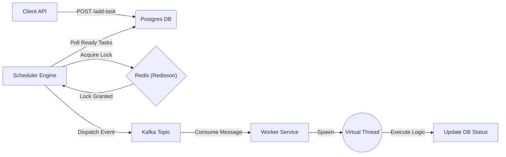

# ⏳ ChronosNode: Distributed Task Scheduler


**ChronosNode** is a high-throughput, fault-tolerant distributed task scheduler designed to handle delayed execution at scale. It leverages **Distributed Locking** to ensure exactly-once scheduling across multiple nodes and uses **Java 25 Virtual Threads** for high-concurrency task execution.

## 🏗 Architecture

The system follows an **Event-Driven Architecture (EDA)** to decouple the scheduling logic from the execution logic.



## 🚀 Key Features

* **Distributed Locking (Redlock):** Uses Redis to elect a "Leader" node for scheduling, preventing duplicate task processing in a multi-node cluster.
* **Virtual Threads (Project Loom):** Utilizes Java 25's lightweight threads to handle thousands of concurrent I/O-bound tasks with minimal memory footprint.
* **Event-Driven Decoupling:** Separates the *finding* of tasks (Scheduler) from the *execution* of tasks (Worker) using Apache Kafka.
* **Fault Tolerance:** Implements exponential backoff and Dead Letter Queues (DLQ) for failed tasks.
* **Idempotency:** Ensures tasks are executed exactly once, even in the event of network partitions or message duplication.

## 🛠 Tech Stack

* **Core:** Java 25, Spring Boot 3.4
* **Database:** PostgreSQL (Hibernate/JPA)
* **Messaging:** Apache Kafka
* **Caching/Locking:** Redis (Redisson)
* **Containerization:** Docker & Docker Compose

## 🧠 Design Decisions (Interview Q&A)

### 1. Why Redis for Locking instead of the Database?
**Decision:** We use `Redisson` for distributed locking rather than a database row lock (`SELECT FOR UPDATE`).
**Reasoning:** Database locks reduce throughput and increase contention on the persistence layer. Redis `SETNX` operations are $O(1)$ and extremely fast, allowing the database to focus purely on transactional data.

### 2. Why Virtual Threads?
**Decision:** The Worker uses `Executors.newVirtualThreadPerTaskExecutor()`.
**Reasoning:** Traditional Platform Threads map 1:1 to OS threads, which are expensive (~1MB RAM each). Virtual Threads are managed by the JVM, allowing us to spawn 10,000+ concurrent threads for I/O-bound tasks (like API calls) without exhausting system memory.

### 3. Why Kafka?
**Decision:** Tasks are pushed to a Kafka topic rather than executed immediately by the Scheduler.
**Reasoning:** This provides **Backpressure Handling**. If the system is flooded with 10k tasks, the Scheduler dumps them into Kafka instantly. The Workers can then process them at their own pace without crashing the application.

## ⚡ How to Run

### Prerequisites
* Java 21+ (Java 25 recommended)
* Docker & Docker Compose

### Steps
1.  **Start Infrastructure:**
    ```bash
    docker-compose up -d
    ```
2.  **Run Application:**
    ```bash
    ./mvnw spring-boot:run
    ```
3.  **Trigger a Task:**
    ```bash
    curl -X POST "http://localhost:8080/add-task?name=DemoTask"
    ```
4.  **Verify Logs:**
    You will see the flow: `Leader Election` -> `Kafka Dispatch` -> `Virtual Thread Execution`.
